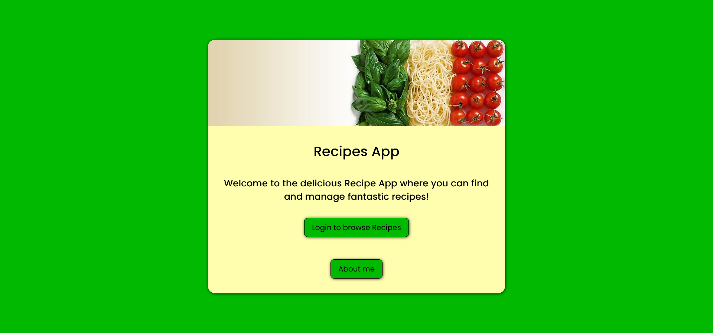

# Recipe App

This is a recipe web app where users can log in, view and search recipes as well as see statistics about the recipes that came up during the search.

This app was created during the CareerFoundry Python Specialization Course. The app can be found under the src folder.

## Used technologies
- Python
- Django
- HTML
- CSS
- JavaScript

## Link to the live version

The online hosted version of this app can be found here: [Recipe App](https://django-recipe-app-d9f628d5ba3f.herokuapp.com/).
